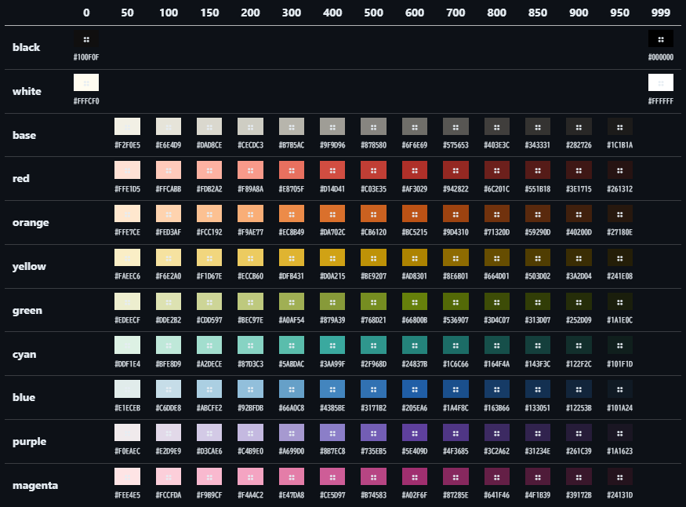

# PostCSS Enumerates in Line

|言語|Language|
|---|---|
|[ 日本語](README.md)|[ English](README_EN.md)|


## 更新点: v0.4.0

1. 色設定

- CSSプロパティ値に色設定を行う`color[[...]]`関数を追加
- プラグインのオプションに色テーマを追加する`appendUserColors(...)`を追加
- プラグインオプション`prependDefaultColor`の初期設定を`false`に変更

2. ショートハンド設定

- プラグインのオプションにユーザー定義ショートハンドを拡張する`appendShorthand(...)`を追加

3. CSSプロパティ

- 条件付きCSSプロパティ`attr(<attributes>)!`を追加


## 実装予定

- サンプルプログラムの更新
- メジャーアップデート


---

この[PostCSS]プラグインは、複数のCSSプロパティを1つの行にまとめ上げて記述できるようにします。

[Tailwind CSS]の`@apply`構文と似た働きをします。

```scss
// header
.c-header {
  @enums my:1.5rem;

  &--caption {
    @enums ff:"Rammetto^One",sans-serif fs:1.25em;
  }

  &--description {
    @enums fs:0.85em;
  }
}
```

具体的には上のような書式を取ります。（言語は[SCSS]）

> `@enum`で始まるat-rulesの一種であり、`@apply`と記述方法は全く同じです。
>
> `my`は`margin-top` & `margin-bottom`の、`ff`は`font-family`の、`fs`は`font-size`のショートハンドです。
> 何がショートハンドとして定義されているかは[プロパティ名のショートハンド](#プロパティ名のショートハンド)を参照してください。
> またユーザーが独自にショートハンドを登録することも可能です。
>
> `:`記号の前がプロパティ名、後ろがプロパティ値になっています。
> ホワイトスペースはプロパティの区切り文字であるため、プロパティ値に半角スペース記号を使いたい場合は`^`で代用します。

またCSSプロパティ名の先頭に以下の書式を加筆することで、条件付きCSSプロパティに対応することができます。

- `hover!`: :hover
- `dark!`: :root.dark
- `mq(<mediaQueries>)!`: @media screen and &lt;mediaQueries&gt;
- `data(<customDataElements>)!`: [data-&lt;customDataElement&gt;]
- `aria(<ariaAttributes>)!`: [aria-&lt;ariaAttributes&gt;]
- `attr(<attributes>)!`: [&lt;attributes&gt;]

> 詳しい書式は目次の次へお進みください。

基本的には[gulp]および[gulp-postcss]での動作を想定していますが、JS-APIによるPostCSS単体でも動作します。

[PostCSS]: https://github.com/postcss/postcss
[Tailwind CSS]: https://tailwindcss.com/
[SCSS]: https://sass-lang.com/
[gulp]: https://gulpjs.com/
[gulp-postcss]: https://github.com/postcss/gulp-postcss
[Flexoki]: https://stephango.com/flexoki

<div class="x--hr"></div>


## 目次

- [PostCSS Enumerates in Line](#postcss-enumerates-in-line)
  - [更新点: v0.4.0](#更新点-v040)
  - [実装予定](#実装予定)
  - [目次](#目次)
  - [CSSでの記述方法](#cssでの記述方法)
    - [条件付き書式](#条件付き書式)
      - [ダークモード](#ダークモード)
      - [マウスオーバー](#マウスオーバー)
      - [メディアクエリ](#メディアクエリ)
      - [カスタムデータ属性](#カスタムデータ属性)
      - [ARIA属性](#aria属性)
      - [属性プロパティ](#属性プロパティ)
    - [特殊な記号](#特殊な記号)
      - [コロン記号](#コロン記号)
      - [エクスクラメーション記号](#エクスクラメーション記号)
      - [サーカムフレックス記号](#サーカムフレックス記号)
      - [二重角括弧記号](#二重角括弧記号)
    - [デフォルトカラー](#デフォルトカラー)
    - [プロパティ名のショートハンド](#プロパティ名のショートハンド)
      - [ショートハンドのユーザー定義](#ショートハンドのユーザー定義)
  - [プラグインを使用する方法](#プラグインを使用する方法)
    - [gulpでの使い方](#gulpでの使い方)
      - [package.json](#packagejson)
      - [Javascriptモジュール](#javascriptモジュール)
        - [読み込み処理](#読み込み処理)
        - [タスク処理](#タスク処理)
      - [サンプルのソースファイル](#サンプルのソースファイル)
      - [実行](#実行)
    - [JS-APIでの使い方](#js-apiでの使い方)
      - [package.json](#packagejson-1)
      - [Javascriptモジュール](#javascriptモジュール-1)
        - [読み込み処理](#読み込み処理-1)
        - [タスク処理](#タスク処理-1)
      - [サンプルのソースファイル](#サンプルのソースファイル-1)
      - [実行](#実行-1)
  - [オプション引数](#オプション引数)
    - [prependDefaultColor](#prependdefaultcolor)
    - [prependDefaultStyle](#prependdefaultstyle)
    - [appendShorthand](#appendshorthand)
    - [appendUserColor](#appendusercolor)
      - [color\[\[...\]\]関数](#color関数)
      - [prependDefaultColorオプション](#prependdefaultcolorオプション)

<div class="x--hr"></div>


## CSSでの記述方法

CSS（やSCSSなど）での書式は単純です。

```scss
html {
  @enums background-color:#000 color:#fff;

  h1 {
    @enums font-size:100% hover!color:red;
  }
}
```

[Tailwind CSS]における`@import tailwindcss;`のような記述をCSS側ファイルに行う必要はありません。

`@enums`で開始し、`;`で終了します。

ホワイトスペースで区切られているため、半角スペースだけでなく改行記号でも複数あるCSSスタイル宣言を分割することができます。

CSSスタイル宣言についても単純で、「`プロパティ名`・`半角コロン記号`・`プロパティ値`」の組み合わせになっています。

プロパティ値は任意の値を取ることができるため、`border:1px^#888^solid`など自由な指示をすることができるでしょう。


### 条件付き書式

```scss
h1 {
  @emums data(visible="hidden")!display:none
  ct:blue hover!ct:red
  cb:white dark!cb:black
  mq(width:1000px-)!mx:auto;
}
```

上記のように`条件付き書式!CSSプロパティ名:CSSプロパティ値`と記法を拡張することができます。

`hover!`, `dark!`, `mq(...)!`, `data(...)!`, `aria(...)!`, `attr(...)!`はそれぞれ重ね掛けが可能です。

```scss
h1 {
  @enums dark!hover!ct:red;
}
```

ただしこれら条件付き書式は１つのCSSプロパティにつき１種しか設定できないため、`mq(...)!`・`data(...)!`・`aria(...)!`・`attr(...)!`を連続して記述できません。

列挙する場合は`(`・`)`の中で、`,`を使ってください。

同種の条件付き書式を重複させた場合、最初のものだけが適用され、残りの指定内容は無視されます。

```scss
/* ❌️NG */
h1 {
  @enums mq(width:-640px)!mq(orientation:portrait)!m2:auto
  data(state="succeed")!data(target-href^="https://")!text-indent:1rem;
}

/* ⭕️OK */
h1 {
  @enums mq(width:-640px,orientation:portrait)!m2:auto
  data(state="succeed",target-href^="https://")!text-indent:1rem;
}

/* 🙂Unzip */
@media screen and (max-width: 640px) and (orientation: portrait) {
  h1 {
    margin-bottom: auto;
  }
}
h1[data-state="succeed"][data-target-href^="https://"] {
  text-indent: 1rem;
}
```


#### ダークモード

条件付き書式`dark!`を使うと、`root:`（html要素）に`dark`クラスが存在するかどうかで判定できるようになります。

```scss
/* 🚧Before */
h1 {
  @emums cb:white dark!cb:black;
}

/* 🚀After */
h1 {
  background-color: white;
}
:root.dark h1 {
  background-color: black;
}
```


#### マウスオーバー

条件付き書式`hover!`を使うと、`:hover`（マウスオーバー状態）擬似クラスを追加できます。

```scss
/* 🚧Before */
h1 {
  @emums ct:blue hover!ct:red;
}

/* 🚀After */
h1 {
  color: blue;
}
h1:hover {
  color: red;
}
```


#### メディアクエリ

条件付き書式`mq(<mediaQueries>)!`を使うと、`@media`ルールの中に入れることができます。

複数のメディアクエリを組み合わせる場合は、`,`で区切ります。

```scss
/* 🚧Before */
h1 {
  @emums mq(width:1000px-)!m2:auto
  mq(height:-1000px,aspect-ratio:1-)!p:1.5rem;
}

/* 🚀After */
@media screen and (min-width: 1000px) {
  h1 {
    margin-bottom: auto;
  }
}
@media screen and (max-height: 1000px) and (min-aspect-ratio: 1) {
  h1 {
    padding: 1.5rem;
  }
}
```

`mq(...)`関数の引数となるメディアクエリは、`メディア特性`・`:`・`条件値`の組み合わせになっています。

利用可能なメディア特性は次の通りですが、条件値によって出力される実際のメディア特性が変化します。

- `orientation`: orientation
- `width`: width, min-width, max-width
- `height`: height, min-height, max-height
- `aspect-ratio`: aspect-ratio, min-aspect-ratio, max-aspect-ratio

> `orientation`に指定可能な条件値は、`portrait`（縦長または正方形）と`landscape`（横長）のいずれかのみです。

```scss
body {
  @enums
  mq(orientation:portrait)!m2:1rem
  mq(orientation:landscape)!m8:1rem
  ;
}
```

> `width`に指定可能な条件値は、`-<length>`・`<length>-<length>`・`<length>-`の３種類です。
>
> `<length>`に指定可能なのは`px`・`rem`・`vw`など長さに関わる値です。
>
> + １つのみある`<length>`の前に`-`を付けた場合、`<length>`以下のメディアクエリを意味します（適用されるメディア特性は`max-width`）
> + ２つの`<length>`を`-`で接続した場合、その区間以内であるメディアクエリを意味します（適用されるメディア特性は`min-width`と`max-width`）
> + １つのみある`<length>`の後ろに`-`を付けた場合、`<length>`以上のメディアクエリを意味します（適用されるメディア特性は`min-width`）

```scss
body {
  @enums
  mq(width:-480px)!m2:1rem
  mq(width:640px-1024px)!mx:1rem
  mq(width:1280px)!m8:1rem
  ;
}
```

> `height`に指定可能な条件値、および動作は`width`と同じです。
>
> ただし適用されるメディア特性は、`height`・`min-height`・`max-height`に変化します。

```scss
body {
  @enums
  mq(height:-480px)!m2:1rem
  mq(height:640px-1024px)!mx:1rem
  mq(height:1280px)!m8:1rem
  ;
}
```

> `aspect-ratio`に指定可能な条件値は、`整数値`（1など）または`小数値`（0.85など）です。
>
> `@media (aspect-ratio: 16/9)`のような除算記号（`/`）を使った表記はできません。
>
> `width`・`height`に似た表記が可能で、`-<number>`・`<number>-<number>`・`<number>-`の３種類と`<number>`が実際に指定可能な条件値です。
>
> + １つのみある`<number>`の前に`-`を付けた場合、`<number>`以下のメディアクエリを意味します（適用されるメディア特性は`max-aspect-ratio`）
> + ２つの`<number>`を`-`で接続した場合、その区間以内であるメディアクエリを意味します（適用されるメディア特性は`min-aspect-ratio`と`max-aspect-ratio`）
> + １つのみある`<number>`の後ろに`-`を付けた場合、`<number>`以上のメディアクエリを意味します（適用されるメディア特性は`min-aspect-ratio`）
> + `<number>`が１つのみあって`-`がない場合、アスペクト比が`<number>`とまったく等しい状態を意味します（適用されるメディア特性は`aspect-ratio`）

```scss
body {
  @enums
  mq(aspect-ratio:-0.5)!m2:1rem
  mq(aspect-ratio:0.55-0.95)!mx:1rem
  mq(aspect-ratio:1.25-)!m8:1rem
  mq(aspect-ratio:1)!p:1rem
  ;
}
```


#### カスタムデータ属性

条件付き書式`data(<customDataElements>)!`を使うと、`[data-foo="bar"]`のようなカスタムデータによる属性セレクターを追加できます。

複数の属性セレクターを組み合わせる場合は、`,`で区切ります。

```scss
/* 🚧Before */
h1 {
  @emums data(visible="hidden")!display:none;
}

/* 🚀After */
h1[data-visible="hidden"] {
  display: none;
}
```

属性セレクターは`属性名`、または`属性名`・`条件演算子`・`属性データ`の組み合わせになっています。

属性名が存在することだけを条件にする場合は、`条件演算子`と`属性データ`を必要としません。

```scss
/* 🚧Before */
h1 {
  @enums data(loading)!display:none
  data(is-empty="false")!m8:1rem;
}

/* 🚀After */
h1[data-loading] {
  display: none;
}
h1[data-is-empty="false"] {
  margin-top: 1rem;
}
```

> 属性名には`data-`に続く文字列を指定します。
>
> 具体的には`/[A-Za-z\d_\-]/`の文字が使用可能ですが、属性名の始端または終端を`-`の文字列とすることはできません。

> 条件演算子には次の種類を使用することができます。
> + `=`: 属性データと一致する場合（`[data-foo="bar"]`）
> + `~=`: 属性データが空白記号区切りリストであり、その中の１つと一致する場合（`[data-tags~="ipsum"]`, `<span data-tags="lorem ipsum dolor sit amet"></span>`）
> + `^=`: 属性データの文字列で始まる場合（`[data-href^="https://"]`）
> + `$=`: 属性データの文字列で終わる場合（`[data-href$=".webp"]`）
> + `*=`: 属性データの文字列を含む場合（`[data-alphabet*="bcdef"]`）
> + `|=`: 属性データと一致する文字列で始まり、かつその後ろに半角ハイフン記号を伴う場合（`[data-lang|="en"]`）
>
> > 言語タグとして`en-US`や`en-GB`など、ISO 639 + ISO 3166による表現を行う場合に利用されることの多い表現です。

> 属性データは、`"`または`'`で囲まれている必要があります。
>
> このため引用符を使う場合は注意してください。
>
> またパッケージの内部処理により、以下の文字が属性データに含まれる場合はパーセントエンコーディングを行います。
> + `%`: %25
> + `"`: %22
> + `'`: %27
> + `｀`: %60
> + `\`: %5D


#### ARIA属性

条件付き書式`aria(<ariaAttributes>)!`を使うと、`[aria-label="heading"]`のようなARIA属性によるセレクターを追加できます。

複数の属性セレクターを組み合わせる場合は、`,`で区切ります。

```scss
/* 🚧Before */
h1 {
  @emums aria(label="heading")!fs:1.5rem;
}

/* 🚀After */
h1[aria-label="heading"] {
  font-size: 1.5rem;
}
```

属性セレクターは`属性名`・`=`・`属性データ`の組み合わせになっています。

> 属性名には`aria-`に続く文字列を指定します。
>
> `/[a-z]/`の文字しか使うことはできません。

> 条件演算子は現在`=`のみを有効にしています。
>
> 必要になれば`data(...)!`と同等の条件にまで拡張するかもしれません。

> 属性データは、`"`または`'`で囲まれている必要があります。
>
> このため引用符を使う場合は注意してください。
>
> またパッケージの内部処理により、以下の文字が属性データに含まれる場合はパーセントエンコーディングを行います。
> + `%`: %25
> + `"`: %22
> + `'`: %27
> + `｀`: %60
> + `\`: %5D


#### 属性プロパティ

カスタムデータ属性（`[data-*]`）とARIA属性（`[aria-*]`）について専用の条件付き書式を設けていますが、それ以外の属性プロパティ（`[*]`）も`attr(...)!`を使うことで記述可能です。

そのため`data(foo="bar")!`と`attr(data-foo="bar")!`は等価になります。

複数の属性セレクターを組み合わせる場合は、`,`で区切ります。

```scss
/* 🚧Before */
h1 {
  @emums attr(download)!ct:red attr(title="heading",data-tags~="hello")!bw2:1px;
}

/* 🚀After */
h1[download] {
  color: red;
}
h1[title="heading"][data-tags~="hello"] {
  border-bottom-width: 1px;
}
```

属性セレクターは`属性名`、または`属性名`・`条件演算子`・`属性データ`の組み合わせになっています。

属性名が存在することだけを条件にする場合は、`条件演算子`と`属性データ`を必要としません。

詳細は[カスタムデータ属性](#カスタムデータ属性)を参照してください。


### 特殊な記号

特殊な振る舞いを起こす文字は、`:`・`^`・`!`・`[[`・`]]`の５種類です。


#### コロン記号

前述の通り`:`記号はプロパティ名とプロパティ値を区切るために使います。

このため`content:":"`という表記はできません。

`content:"\03A"`のように文字エスケープを行ってください。


#### エクスクラメーション記号

`padding-top:1rem!`などのようにして、`!`記号をプロパティ値の末尾に付けると`!important`宣言をしたことになります。

> 条件付き書式の`!`とは働きが異なるためご注意ください。


#### サーカムフレックス記号

`^`記号はこのPostCSSプラグインにおいて半角スペースに自動変換されます。

上述の`border:1px^#888^solid`など、ホワイトスペースで区切る必要がある場合に使用します。

一括指定型プロパティだけでなく、演算記号の問題や、複数のプロパティ値を持つ場合、`//`の回避などに使うことができます。どういう事例を想定しているかはNo. 1から3を参照してください。


1. 演算記号

`calc(100vw - 1rem)`などの算術関数の中で使われる演算記号（`+`・`-`・`*`・`/`）は、両端に空白記号を挿入する必要があります。空白記号を補うために`calc(100vw^-^1rem)`のようにしてください。


2. 複数のプロパティ値

`filter:blur(5px) grayscale(80%)`などのような複数のプロパティ値を組み合わせることで効果を発揮する場合もあります。同様に空白記号を補うべく`filter:blur(5px)^grayscale(80%)`などと表してください。

3. `//`の回避

ショートハンドを利用した特殊な記法として、`border-image: linear-gradient(#333,#333) fill 0 // 0 100vw`のようなものがあります。

> DOM要素の左右へ飛び出してビューポートの横幅いっぱいを塗りつぶすCSSトリックの一種です。

この中に`//`が含まれており、CSSにはブロックコメントアウトしか存在しないため問題ないのですが、SCSSでは一行コメントアウトとして機能してしまうため構文エラーを引き起こします。

> `/ /`のようにして半角スペースを補えば問題ないのですが、CSSの文法として成立する以上は考慮する必要がありました。

そのため`border-image:linear-gradient(#333,#333)^fill^0^/^/^0^100vw`のようにして空白記号に替わる`^`を補い、明示的に`/ /`だと表記してSCSS構文エラーを回避するのです。


#### 二重角括弧記号

なお実験的機能ではありますが、算術関数における演算子（`+`・`-`・`*`・`/`）の空白記号問題については別の解決方法も用意しています。

`width:calc(100vw^-^(100%^+^2rem)^*^2^+^1rem)`のような記述は視覚的ではないため、`[[`と`]]`に囲んだ中であれば`width:calc[[100vw-(100%+2rem)*(2)+1rem]]`としてサーカムフレックス記号を省くことができます。

> `var`関数など算術関数でないものに`[[`・`]]`記号は使わないでください。
>
> 例えば`var(--foo-bar)`が誤変換されて、`var(--foo - bar)`のようにして意味のないCSSへと破壊されてしまうためです。

しかし変換書式を改善中であるため、意図したように演算子の両端へ正常に空白記号が挿入されない可能性があります。

> こうした場合でも`^`記号を補えば正常な算術関数へと修正できるのですが、より確実な手段としては`[[`・`]]`記号を使わず人力で`^`記号を補う方が間違いは少ないでしょう。

---

上記とは別に、`color[[...]]`という独自の構文をCSSプロパティ値に使用することができます。

```scss
h1 {
  @enums ct:color[[yellow,600]];
}
```

`,`区切りの複数の引数を取ることができ、この[パッケージが管理する色情報](README.img/default_color.png)を呼び出すために使います。

これはプラグインオプションの`prependDefaultColor`を`true`にした上で、`@enums ct:var(--color-yellow-600);`を宣言した時と同じ挙動をします。

```scss
h1 {
  @enums ct:color[[cyan,400,95%,rgb]];
}
```

この関数様の構文は、最大で４種類の引数を取ります。

1. 色テーマ（`cyan`など）
2. 濃度レベル（`400`など; 正規表現で書くと`/[\d]+/`）
3. アルファ値（`95%`など; 正規表現で書くと`/[\d]+[%]/`）
4. 出力形式（`rgb`|`hsl`|`oklch`; 大文字小文字は問いません）

既に登録されている色テーマ名を指定することはできません。

これはプラグインが初期状態で実装しているものだけでなく、ユーザー定義による追加された色テーマについても同様です。

> 未指定の種類に対しては、次の初期値が適用されます。
> 1. `base`
> 2. `400`
> 3. `100%`
> 4. `hsl`
>
> 未定義の色テーマや濃度レベルを指定した場合、エラーとして扱われ無視されます。

この関数を使うことで、透過率が設定できる他、色テーマをプラグインのオプションである`appendUserColors(...)`でユーザー独自の定義を追加できる上に、`prependDefaultColor`を初期値の`false`以外にするとCSS変数として色情報が`:root`ブロックに出力されることでCSSファイルサイズが大きくなるなど、様々なデメリットが解消されるでしょう。


### デフォルトカラー

デフォルトカラーは[Flexoki] v2.0からのフォークです。

[](README.img/default_color.png)

`color[[...]]`の項目で説明した通り、`appendUserColors(...)`オプション設定を使うと独自の色テーマを追加することができます。

詳細は[オプション引数](#オプション引数)を参照してください。


### プロパティ名のショートハンド

いくつかのプロパティ名にはショートハンド定義がしてあります。

例えば`border-top-width:1px`は`bw8:1px`と同義となります。

+ margin
  - `m`: margin
  - `m8`: margin-top
  - `m6`: margin-right
  - `m2`: margin-bottom
  - `m4`: margin-left
  - `mx`: margin-left & margin-right
  - `my`: margin-top & margin-bottom
+ padding
  - `p`: padding
  - `p8`: padding-top
  - `p6`: padding-right
  - `p2`: padding-bottom
  - `p4`: padding-left
  - `px`: padding-left & padding-right
  - `py`: padding-top & padding-bottom
+ outline
  - `o`: outline
  - `o8`: outline-top
  - `o6`: outline-right
  - `o2`: outline-bottom
  - `o4`: outline-left
  - `ox`: outline-left & outline-right
  - `oy`: outline-top & outline-bottom
+ border-width
  - `bw`: border-width
  - `bw8`: border-top-width
  - `bw6`: border-right-width
  - `bw2`: border-bottom-width
  - `bw4`: border-left-width
  - `bwx`: border-left-width & border-right-width
  - `bwy`: border-top-width & border-bottom-width
+ border-style
  - `bs`: border-style
  - `bs8`: border-top-style
  - `bs6`: border-right-style
  - `bs2`: border-bottom-style
  - `bs4`: border-left-style
  - `bsx`: border-left-style & border-right-style
  - `bsy`: border-top-style & border-bottom-style
+ border-color
  - `bc`: border-color
  - `bc8`: border-top-color
  - `bc6`: border-right-color
  - `bc2`: border-bottom-color
  - `bc4`: border-left-color
  - `bcx`: border-left-color & border-right-color
  - `bcy`: border-top-color & border-bottom-color
+ border-radius
  - `br`: border-radius
  - `br7`: border-top-left-radius
  - `br9`: border-top-right-radius
  - `br3`: border-bottom-right-radius
  - `br1`: border-bottom-left-radius
+ color
  - `ct`: color
  - `cb`: background-color
+ inset
  - `i`: inset
  - `i8`: top
  - `i6`: right
  - `i2`: bottom
  - `i4`: left
+ sizing
  - `w`: width
  - `wmin`: min-width
  - `wmax`: max-width
  - `h`: height
  - `hmin`: min-height
  - `hmax`: max-height
+ grid position
  - `gx`: grid-column
  - `g4`: grid-column-start
  - `g6`: grid-column-end
  - `gy`: grid-row
  - `g8`: grid-row-start
  - `g2`: grid-row-end
+ font
  - `ff`: font-family
  - `fs`: font-size
  - `fw`: font-weight
  - `fh`: line-height

`x`はleft & right、`y`はtop & bottomの意味です。

数字の`1`から`9`が使われる理由はテンキーの配置を想像してみてください。


#### ショートハンドのユーザー定義

CSSプロパティ名のショートハンドは、プラグインオプションの`appendShorthand(...)`により拡張することができます。

詳細は[オプション引数](#オプション引数)を参照してください。


## プラグインを使用する方法

### gulpでの使い方

動作サンプルを`test/gulp`フォルダに用意してあります。


#### package.json

```powershell
npm init -y
```

`package.json`ファイルの該当箇所を次のように書き換えます。

```json
{
  "type": "module",
  "scripts": {
    "clean": "gulp clean",
    "build": "npm run clean && gulp",
    "dev": "gulp dev"
  }
}
```

```powershell
npm install autoprefixer browser-sync gulp gulp-plumber gulp-postcss gulp-sass postcss-csso postcss-enumerates-in-line sass
```


#### Javascriptモジュール

`gulpfile.mjs`ファイルを作ります。

その中でもこのパッケージに関する処理だけを説明します。


##### 読み込み処理

PostCSS本体や他のプラグインパッケージと同様に読み込みます。

```javascript
// PostCSS
import postcss from 'gulp-postcss'
import autoprefixer from 'autoprefixer'
import csso from 'postcss-csso'
import { enumSpreader } from 'postcss-enumerates-in-line'
```


##### タスク処理

```javascript
// CSS <- SCSS
const task_css = done => {
  src('src/css/**/!(_)*.scss', {
    allowEmpty: true,
  })
  .pipe(plumber())
  .pipe(sass())
  .pipe(postcss([
    enumSpreader({}),
    autoprefixer(),
    csso(),
  ]))
  .pipe(dest('dist/css'))

  done()
}
```

PostCSS処理の配列の中に、`enumSpreader({})`関数を差し込みます。

> Sass (SCSS)の後に実行し、他のPostCSSプラグインよりも前に記述してください。

この関数は初期設定のまま利用する場合は空のオブジェクトを指定します。

動作を変更したい場合は引数にオプション設定を加えます。

設定内容は[オプション引数](#オプション引数)を参照してください。


#### サンプルのソースファイル

`src`・`src/css`・`src/js`・`dist`フォルダを作成し、`src/index.html`・`src/css/app.scss`・`src/js/app.js`ファイルを用意しました。

このパッケージの利用方法は、主に`src/css/app.scss`をご参照ください。


#### 実行

デバッグモードは`npm run dev`、ビルドモードは`npm run build`です。


### JS-APIでの使い方

動作サンプルを`test/postcss`フォルダに用意してあります。

#### package.json

```powershell
npm init -y
```

`package.json`ファイルの該当箇所を次のように書き換えます。

```json
{
  "type": "module",
  "scripts": {
    "clean": "node build-clean.mjs",
    "common:copy": "node build-copy.mjs",
    "build:css": "node build-css.mjs -- build",
    "dev:css": "node build-css.mjs -- dev",
    "build": "npm run clean && run-s common:* build:*",
    "dev": "run-s common:* dev:*"
  }
}
```

```powershell
npm install autoprefixer glob npm-run-all2 postcss postcss-csso postcss-enumerates-in-line sass
```


#### Javascriptモジュール

`build-clean.mjs`・`build-copy.mjs`・`build-css.mjs`ファイルを作ります。

build-clean.mjsとbuild-copy.mjsはこのパッケージに直接関係するものではないため説明を省略します。


##### 読み込み処理

各種パッケージを読み込みます。

```javascript
// Files
import fs from 'node:fs'
import { glob } from 'glob'
import path from 'node:path'

// SCSS
import * as dartSass from 'sass'

// PostCSS
import postcss from 'postcss'
import autoprefixer from 'autoprefixer'
import csso from 'postcss-csso'
import { enumSpreader } from 'postcss-enumerates-in-line'
```


##### タスク処理

```javascript
const task = async () => {
  const files = await glob('src/css/**/!(_)*.scss', {
    ignore: 'node_modules/**',
  })

  files.forEach(file => {
    const distPath = path.dirname(file).replace(/^src/, 'dist') + path.sep + path.basename(file).replace(/\.scss$/, '.css')

    let body = fs.readFileSync(file, {
      encoding: 'utf-8',
    })

    body = dartSass.compile(file).css.replace(/[\t\r\n\s]+/g, ' ')

    postcss([
      enumSpreader({}),
      autoprefixer(),
      csso(),
    ])
    .process(body, {from: file, to: distPath})
    .then(res => {
      fs.writeFileSync(res.opts.to, res.css)
    })
  })
}

task()
```

PostCSS処理の配列の中に、`enumSpreader({})`関数を差し込みます。

> 他のPostCSSプラグインよりも前に記述してください。

この関数は初期設定のまま利用する場合は空のオブジェクトを指定します。

動作を変更したい場合は引数にオプション設定を加えます。

設定内容は[オプション引数](#オプション引数)を参照してください。


#### サンプルのソースファイル

`src`・`src/css`・`src/js`・`dist`フォルダを作成し、`src/index.html`・`src/css/app.scss`・`src/js/app.js`ファイルを用意しました。

このパッケージの利用方法は、主に`src/css/app.scss`をご参照ください。


#### 実行

デバッグモードは`npm run dev`、ビルドモードは`npm run build`です。


## オプション引数

### prependDefaultColor

自動的に出力される色設定への対応内容。

初期値: false (boolean|string)

`true`を設定した時（または`"hsl"`や`"HSL"`を設定した時）において、次のような色設定（HSL形式）がCSSに出力されます。

```css
:root {
  --color-red-400: hsl(5 61% 53.7%);
}
```

これを`false`にすると、色設定は出力されません。

初期状態のHSL形式でなく、RGB形式で出力させたい場合は`"rgb"` (string型; `"RGB"`でも可)と設定してください。

```css
:root {
  --color-red-400: #D14D41;
}
```

また`"oklch"` (string型; `"OKLCH"`でも可)と設定した場合はOKLCH形式で出力します。

```css
:root {
  --color-red-400: oklch(0.597 0.1692 28.38);
}
```


### prependDefaultStyle

自動的に出力されるリセットCSS設定への対応内容。

初期値: true (boolean|string[])

`true`を設定した時（または何も設定しなかった時）、次のようなリセットCSS設定がCSSに出力されます。

```css
*, ::before, ::after, ::backdrop, ::file-selector-button {
  box-sizing: border-box;
  margin: 0;
  padding: 0;
  border: 0 solid;
}
```

これを`false`にすると、リセットCSSの設定は出力されません。

```javascript
prependDefaultStyle: [
  'a { color: red }',
  'a:hover { text-decoration: underline }',
]
```

`prependDefaultStyle`オプションにCSSブロック（string[]型）を記述すると、オリジナルのリセットCSSを追記することができます。

追記するだけであって、このプラグインが最初から搭載しているリセットCSSの一部だけを除去することはできません。

完全に自己流のリセットCSSだけを出力したい場合は`prependDefaultStyle`オプションを`false`にした上で、SCSSファイルにその設定を記述してください。


### appendShorthand

ユーザー定義ショートハンドの追加。

初期値: [] (string[string,string[]])

```javascript
appendShorthand: [
  ['pos', ['position']],
],
```

上記のように指定すると、`pos`が新たに`position`のショートハンドとして機能するようになります。

```javascript
appendShorthand: [
  ['bw246', ['border-bottom-width', 'border-left-width', 'border-right-width']],
],
```

複数のプロパティ名を一括指定することも可能です。

```javascript
appendShorthand: [
  ['lh', ['line-height']],
],
```

`line-height`プロパティには既に`fh`というショートハンドが存在していますが、別名（エイリアス）のショートハンドを与えることもできます。

```javascript
appendShorthand: [
  ['o', ['opacity']],
],
```

しかし上記のように`o`を登録しようとしても、`outline`のショートハンドとして既に登録されているため無視されます。

ショートハンドの設定上書きはできません。

また構文エラーの場合は無視されます。


### appendUserColor

ユーザー定義色テーマの追加。

初期値: [] ({theme: &lt;string&gt;, levels: {level: &lt;number&gt;, rgb: &lt;string&gt;, hsl: &lt;string&gt;, oklch: &lt;string&gt;}[]}[])

```javascript
appendUserColor: [
  {
    theme: 'blood',
    levels: [
      {
        level: 400,
        rgb: '#660000',
        hsl: 'hsl(0 100% 20%)',
        oklch: 'oklch(0.3204 0.1315 29.23)',
      },
      {
        level: 600,
        rgb: '#D1001C',
        hsl: 'hsl(352 100% 41%)',
        oklch: 'oklch(0.5418 0.2202 26.04)',
      },
    ]
  },
]
```

上記のように指定すると、`theme`の`blood`が新しい色テーマとして登録され、濃度レベルは`400`と`600`が利用可能になります。

> デフォルトカラーとして登録されている色テーマ名や、別のユーザー定義色テーマ名とは重複する名称を登録することはできません。

登録済みの色テーマは、次の２種類の方法で呼び出すことが可能です。

1. `color[[...]]`
2. `prependDefaultColor`


#### color[[...]]関数

```scss
/* 🚧Before */
h1 {
  @enums ct:color[[red,400]];
}

/* 🚀After */
h1 {
  color: hsl(5 61% 53.7%);
}
```

色テーマ名（例: `red`）・濃度レベル（例: `400`）・アルファ値（例: `100%`）・出力形式（例: `rgb`）の最大４種類を引数に取り、全てオプション引数であるため省略が可能です。

ただし構文上の制約から、最低１種類は引数として指定してください。

> 1. 色テーマ名
>
> デフォルトカラーまたは`appendUserColor(...)`で登録したもの。
>
> 省略された場合の初期値は`base`。
>
> 未定義の色テーマ名を指定した場合、内部エラー処理により無視されます。

> 2. 濃度レベル
>
> `0`（輝度ほぼ100％）から`999`（輝度ほぼ0％）までの整数
>
> 省略された場合の初期値は`400`
>
> デフォルトカラーはだいたい100区切りの分かりやすい数値になっていますが、`appendUserColor(...)`で登録する場合は独自の数値を与えることが可能です。
>
> 未定義の濃度レベルを指定した場合、内部エラー処理により無視されます。

> 3. アルファ値
>
> `0%`（完全に透明）から`100%`（完全に不透明）までのパーセント値
>
> 省略された場合の初期値は`100%`
>
> `50.5%`のような小数点指定も可能ですが、`1`のようにしてパーセント記号を省略すると濃度レベルだと誤解釈してしまうため必ずパーセント記号を付けてください。

> 4. 出力形式
>
> CSSファイルへ出力する時の書式
>
> 省略された場合の初期値は`hsl`
>
> `hsl`・`rgb`・`oklch`の３種類から選択できます。大文字小文字は問いません。


#### prependDefaultColorオプション

```javascript
enumSpreader({
  prependDefaultColor: true,
  // ...
})
```

プラグインオプションの`prependDefaultColor`を`false`以外の値にすると、色テーマに関するCSS変数が出力されます。

> 指定可能な値は`hsl`・`rgb`・`oklch`、および`true`（`hsl`と等価）です。
>
> `true`以外の文字列リテラルに限り、大文字小文字は問いません。

```css
:root {
  --color-red-400: hsl(5 61% 53.7%);
}
```

この設定を利用して、色設定を行います。

```scss
/* 🚧Before */
h1 {
  @enums ct:var(--color-red-400);
}

/* 🚀After */
h1 {
  color: hsl(5 61% 53.7%);
}
```

この方法のメリットは、PostCSS Enumerates in Lineプラグインの外ででも色設定を利用することができる点にあります。

しかしアルファ値の設定ができなかったり、あるいは大量に出力されるCSS変数のためCSSファイルのサイズが肥大化したりする点はデメリットです。

状況に応じて使い分けてください。
